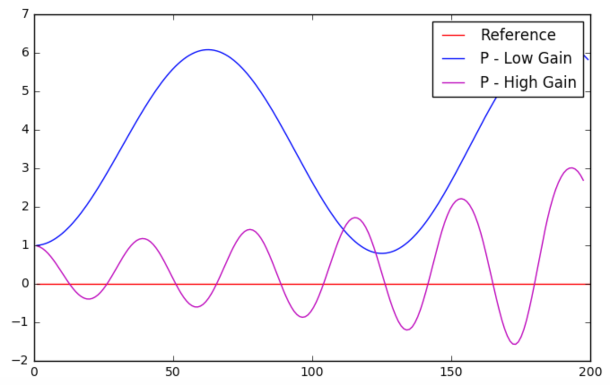

# CarND-Controls-PID Project
Self-Driving Car Engineer Nanodegree Program

By: Chris Gundling

---

## Dependencies

* cmake >= 3.5
 * All OSes: [click here for installation instructions](https://cmake.org/install/)
* make >= 4.1
* gcc/g++ >= 5.4

## Basic Build Instructions

1. Clone this repo.
2. Make a build directory: `mkdir build && cd build`
3. Compile: `cmake .. && make`
4. Run it: `./pid`. 

## Project Description

The goal of this project was to implement a PID controller for autonomous vehicle steering control. A Unity simulator was used to test out the implementation. The vehicle's cross track error was used for the controller. After initially collecting some data from the simulator, a twiddle algorithm was used to optimize the PID parameters. Once the PID parameters were good enough to get the vehicle driving mostly within the lanes, a live fine-tuning twiddle was setup to continuously adjust the parameters to achieve the best cross track error.

## PID Controllers
PID controllers use a combination of Proportional (P), Integral (I) and Derivative (D) components to reduce the error in the system. The effect of each of these components along with plots are described below. A Python Notebook script was created to test different implementations of controllers using the Robot Class.

Proportional - Low proportional gain will cause the vehicle to oscillate and the cross-track error will continue to be high. Increasing the proportional gain helps, but the vehicle can also get out of control if it gets too far from the center line of the track. Using only a proportional controller would cause the vehicle to constantly overshoot its desired trajectory.

Derivative - Low derivative gain leads to an underdamped system that is similar to only using a P-controller. Too high derivative gain will cause an overdamped system that takes an extremely long time to return the desired path. Selecting the right derivative gain allows the vehicle to return to the desired path quickly and then maintains a small cross track error rate (critically damped). 

Integral - The integral term controls the offset of the vehicle. If there is some inherent offet built into the system or introduced to the system, the integral term will sum up the CTE over time and correct for this error. If the integral gain is too high it can lead to large oscillations and too low can take too long correct for offsets.

Twiddle - This optimization algorithm continuously tries different PID parameter values and compares the current error to the best ever error in order to decide on whether to except the update. In this way, the best controller values can be learned over several iterations. The following plot shows the results of all the different types of controller, with the twiddle perfoming the best.

## Reflections
While it should have been expected, I was somewhat surprised to find that the twiddle updates would move the integral gain to nearly zero. The simulator vehicle has no offsets in its steering behavior, so the integral term is not needed for this simple application. Using live fine-tuning twiddle algorithm typically produced proportional gain Kp ~= 0.3 and Kd ~= 10.0. This allowed for the vehicle to drive smoothely and consistently around the track. A video is linked below.

My original goal was to try to set the PID gains all to small values and use live twiddle updates to determine the parameter values from scratch. This did not work as the car would get off the simulator track before the twiddle had enough time to optimize the parameters. The solution was to get rough numbers for the parameters by collecting 'training data' and using twiddle. Then I could use the live twiddle updates to fine tune the controller.

Youtube Link: https://youtu.be/wlMehF2UGuw
